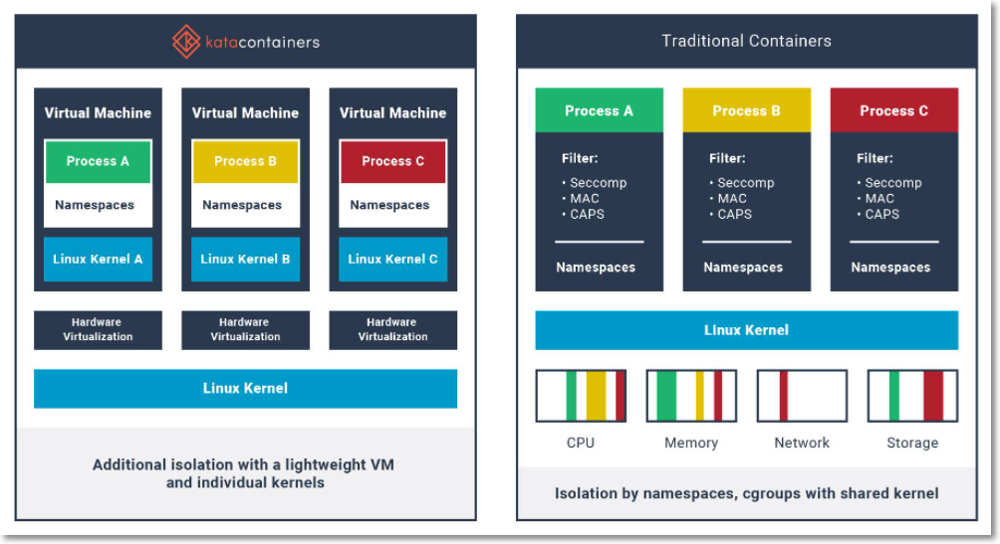
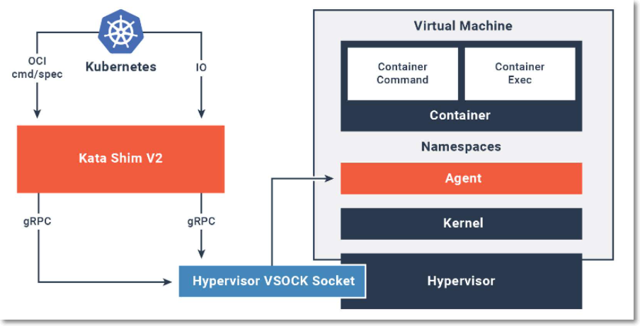

# Secure workload isolation with Amazon EKS Distro and Kata Containers

## Introduction

Containers have introduced a paradigm shift in how we work with applications, and due to the additional efficiencies in deployment, packaging, and development, the rate of adoption has been skyrocketing.

Many people new to containerisation tend to adopt the mental model that containers are simply a better and faster way of of running virtual machines (VMs). In many respects this analogy holds up (albeit from a very simplistic point of view), however from a security perspective, the two technologies provide a very different posture.

Standard Linux containers allow applications to make system calls directly to the host operating system (OS) kernel, in a similar way that non-containerised applications do - whereas in a VM environment, processes in a virtual machine simply do not have visibility of the host OS kernel.

If you're not running untrusted code in your containers, or hosting a multi-tenant platform; and you've implemented good security practices for the services running within each container, you probably don't need to worry.

But for those of us that are faced with the challenge of needing to running untrusted code in our containers, or perhaps are hosting a multi-tenant platform - providing the highest levels of isolation between workloads in a Kubernetes environment can be challenging.

An effective approach to improve workload isolation is to run each Pod within its own dedicated VM. This provides each Pod with a dedicated hypervisor, OS kernel, memory, and virtualized devices which are completely separate from the host OS. In this deployment scenario, when there's a vulnerability in the containerised workload - the hypervisor within the Pod provides a security boundary which protects the host operating system, as well as other workloads running on the host.

  
*Image courtesy of https://katacontainers.io*

If you're running on the AWS cloud, Amazon have made this approach very simple. Scheduling Pods using the managed Kubernetes service [EKS](https://aws.amazon.com/eks) with [Fargate](https://aws.amazon.com/fargate/) actually ensures that each Kubernetes Pod is automatically encapsulated inside it's own dedicated VM. This provides the highest level of isolation for each containerised workload.

If you need to provide a similar level of workload isolation as EKS with Fargate when operating outside of the AWS cloud (e.g. on premises, or at the edge in a hybrid deployment scenario), then [Kata Containers](https://katacontainers.io) is a technology worth considering. Kata Containers is an implementation of a lightweight VM that seamlessly integrates with the container ecosystem, and can be used by Kubernetes to schedule Pods inside of VMs.

The following tutorial will take you through a deployment scenario where we bootstrap a Kubernetes cluster using Amazon EKS Distro (EKS-D), and configure Kubernetes to be capable of scheduling Pods inside VMs using Kata Containers.

This is a deployment pattern that can be adopted to provide a very high degree of workload isolation when provisioning clusters outside of the AWS cloud, for example on-premises, edge locations, or on alternate cloud platforms:

- EKS-D provides the same software that has enabled tens of thousands of Kubernetes clusters on Amazon EKS. This includes the latest upstream updates, as well as extended security patching support.

- In-cluster workload isolation is further enhanced by providing the ability to schedule Pods inside a dedicated VM using Kata Containers.

### About Kata Containers

Kata Containers utilizes open source hypervisors as an isolation boundary for each container (or collection of containers in a Pod).

With Kata Containers, a second layer of isolation is created on top of those provided by traditional namespace containers. The hardware virtualization interface is the basis of this additional layer. Kata launches a lightweight virtual machine, and usees the VM guest’s Linux kernel to create a container workload, or workloads in the case of multi-container Pods. In Kubernetes and in the Kata implementation, the sandbox is implemented at the Pod level. In Kata, this sandbox is created using a virtual machine.

Kata currently supports [multiple hypervisors](https://github.com/kata-containers/kata-containers/blob/main/docs/hypervisors.md), including: QEMU/KVM, Cloud Hypervisor/KVM, and Firecracker/KVM.

#### Kata Containers with Kubernetes

Kubernetes Container Runtime Interface (CRI) implementations allow using any OCI-compatible runtime with Kubernetes, such as the Kata Containers runtime. Kata Containers support both the [CRI-O](https://github.com/kubernetes-incubator/cri-o) and [CRI-containerd](https://github.com/containerd/cri) CRI implementations. 

Kata Containers 1.5 introduced the `shimv2` for containerd 1.2.0, reducing the components required to spawn Pods and containers. This is currently the preferred way to run Kata Containers with Kubernetes.

When configuring Kubernetes to integrate with Kata, typically a Kubernetes [`RuntimeClass`](https://kubernetes.io/docs/concepts/containers/runtime-class/) is created. The RuntimeClass provides the ability to select the container runtime configuration to be used for a given workload via the Pod spec submitted to the Kubernetes API.

  
*Image courtesy of https://katacontainers.io*

#### About Amazon EKS Distro

[Amazon EKS Distro](https://distro.eks.amazonaws.com) is a Kubernetes distribution used by Amazon EKS to help create reliable and secure clusters. EKS Distro includes binaries and containers from open source Kubernetes, etcd (cluster configuration database), networking, storage, and plugins, all tested for compatibility. You can deploy EKS Distro wherever your applications need to run.

You can deploy EKS Distro clusters and let AWS take care of testing and tracking Kubernetes updates, dependencies, and patches. The source code, open source tools, and settings are provided for reproducible builds. EKS Distro provides extended support for Kubernetes, with builds of previous versions updated with the latest security patches. EKS Distro is available as open source on [GitHub](https://github.com/aws/eks-distro).


## Tutorial

### Overview

This tutorial will guide you through the following procedure:

- Installing Kata Containers onto a bare metal host
- Installing and configuring containerd to integrate with Kata Containers
- Bootstrapping an EKS Disto Kubernetes cluster using kubeadm
- Configuring a Kubernetes RuntimeClass to schedule Pods to Kata VMs running the QEMU/KVM hypervisor

> The example EKS-D cluster deployment uses kubeadm to bring up the control-plane, which may not be your preferred method to bootstrap a cluster in an environment outside of a managed cloud provider. A number of AWS partners are also providing installation support for EKS Distro, including: Canonical (MicroK8s), Kubermatic (KubeOne), Kubestack, Nirmata, Rancher, and Weaveworks. For further information, see the [Partners section](https://distro.eks.amazonaws.com/users/install/partners/) at the EKS DIstro website.*

### Prerequisites

Kubeadm is a tool built to provide `kubeadm init` and `kubeadm join` as best-practice "fast paths" for creating Kubernetes clusters.

You will need to use a Linux system that kubeadm supports, as described in the [kubeadm documentation](https://kubernetes.io/docs/setup/production-environment/tools/kubeadm/install-kubeadm/) to verify that the system has the required amount of memory, CPU, and other resources.

Kata Containers requires nested virtualization or bare metal. Review the [hardware requirements](https://github.com/kata-containers/kata-containers/blob/main/src/runtime/README.md#hardware-requirements) to see if your system is capable of running Kata Containers.

#### Clone the `eksd-kata-containers` git repository
Sample configuration files will be used through the course of the tutorial, which have been made available within the `eksd-kata-containers` repository.

Clone the eksd-kata-containers repository to the host on which you will be bootstrapping the cluster:

``` bash
git clone https://gitlab.com/byteQualia/eksd-kata-containers.git
```

### Bootstrap the Cluster

Next, bootstrap the cluster using kubeadm.

#### Prepare the host

Make sure SELinux is disabled by setting SELINUX=disabled in the /etc/sysconfig/selinux file. To turn it off immediately, type:

```bash
sudo setenforce 0
```

Make sure that swap is disabled and that no swap areas are reinstated on reboot. For example, type:

```bash
sudo swapoff -a
```

Permanently disable swap by commenting out or deleting any swap areas in /etc/fstab.

Depending on the exact Linux system you installed, you may need to install additional packages. For example, with an RPM-based (Amazon Linux, CentOS, RHEL or Fedora), ensure that the `iproute-tc`, `socat`, and `conntrack-tools` packages are installed.

To optionally enable a firewall, run the following commands, including opening ports required by Kubernetes:

```bash
sudo yum install firewalld -y
sudo systemctl start firewalld
sudo systemctl enable firewalld
sudo firewall-cmd --zone=public --permanent --add-port=6443/tcp --add-port=2379-2380/tcp --add-port=10250-10252/tcp
```

#### Install container runtime, Kata Containers, and supporting services

Next we need to install a container runtime ([containerd](https://containerd.io) in this example), Kata Containers, and the EKS-D versions of Kubernetes software components.

It's recommended that for production environments both the containerd runtime and Kata Containers are installed using official distribution packages. In this example we will utilise [Kata Manager](https://github.com/kata-containers/kata-containers/blob/main/utils/README.md), which will perform a scripted installation of both components:

```bash
repo="github.com/kata-containers/tests"
go get -d "$repo"
PATH=$PATH:$GOPATH/src/${repo}/cmd/kata-manager
kata-manager.sh install-packages
```

Once installed, update the system path to include Kata binaries:

```bash
sudo su
PATH=$PATH:/opt/kata/bin/
echo "PATH=$PATH:/opt/kata/bin/" >> .profile
exit
```

Verify the host is capable of running Kata Containers:

```bash
kata-runtime kata-check
```

Example output generated on a supported system will read as similar to the following:

```bash
sudo kata-runtime kata-check
WARN[0000] Not running network checks as super user      arch=amd64 name= pid=9064 source=runtime
System is capable of running Kata Containers
System can currently create Kata Containers
```


#### Configure container runtime for Kata

`cri` is a native plugin of containerd 1.1 and above, and it's built into containerd and enabled by default. In order to configure containerd to schedule Kata containers, you need to update the containerd configuration file located at  `/etc/containerd/config.toml` with the following configuration which includes three runtime classes:

- `plugins.cri.containerd.runtimes.runc`: the runc, and it is the default runtime
- `plugins.cri.containerd.runtimes.kata`: The function in containerd (reference [the document here](https://github.com/containerd/containerd/tree/master/runtime/v2#binary-naming)) where the dot-connected string `io.containerd.kata.v2` is translated to `containerd-shim-kata-v2` (i.e. the binary name of the Kata implementation of [Containerd Runtime V2 (Shim API)](https://github.com/containerd/containerd/tree/master/runtime/v2)).
- `plugins.cri.containerd.runtimes.katacli`: the `containerd-shim-runc-v1` calls `kata-runtime`, which is the legacy process.

Example `config.toml`:

```bash
plugins.cri.containerd]
 no_pivot = false
plugins.cri.containerd.runtimes]
 [plugins.cri.containerd.runtimes.runc]
    runtime_type = "io.containerd.runc.v1"
    [plugins.cri.containerd.runtimes.runc.options]
      NoPivotRoot = false
      NoNewKeyring = false
      ShimCgroup = ""
      IoUid = 0
      IoGid = 0
      BinaryName = "runc"
      Root = ""
      CriuPath = ""
      SystemdCgroup = false
 [plugins.cri.containerd.runtimes.kata]
    runtime_type = "io.containerd.kata.v2"
[plugins.cri.containerd.runtimes.kata.options]
  ConfigPath = "/opt/kata/share/defaults/kata-containers/configuration-qemu.toml"
 [plugins.cri.containerd.runtimes.katacli]
    runtime_type = "io.containerd.runc.v1"
    [plugins.cri.containerd.runtimes.katacli.options]
      NoPivotRoot = false
      NoNewKeyring = false
      ShimCgroup = ""
      IoUid = 0
      IoGid = 0
      BinaryName = "/opt/kata/bin/kata-runtime"
      Root = ""
      CriuPath = ""
      SystemdCgroup = false
```

From the cloned `eksd-kata-containers` repository, copy the file `/config/config.toml` to 
`/etc/containerd/config.toml` and restart containerd:

```bash
sudo systemctl stop containerd
sudo cp eksd-kata-containers/config/config.toml /etc/containerd/
sudo systemctl start containerd
```

containerd is now able to run containers using the Kata Containers runtime. 

#### Test Kata with containerd

In order to test that containerd can successfully run a Kata container, a shell script named `test-kata.sh` has been provided in the `script` directory within the `eksd-kata-containers` repository.

`test-kata.sh` uses the `ctr` CLI util to pull and run a busybox image as a Kata container, and retrieves the kernel version from within the Kata VM. The script returns both the kernel version reported by busybox from within the Kata VM, as well as the host OS kernel version. Per the sample output, the container (VM) kernel is different to the host OS kernel:

```bash
chmod +x eksd-kata-containers/script/check-kata.sh
./eksd-kata-containers/script/check-kata.sh

Testing Kata Containers..

docker.io/library/busybox:latest:                                                 resolved       |++++++++++++++++++++++++++++++++++++++|
index-sha256:ae39a6f5c07297d7ab64dbd4f82c77c874cc6a94cea29fdec309d0992574b4f7:    exists         |++++++++++++++++++++++++++++++++++++++|
manifest-sha256:1ccc0a0ca577e5fb5a0bdf2150a1a9f842f47c8865e861fa0062c5d343eb8cac: exists         |++++++++++++++++++++++++++++++++++++++|
layer-sha256:f531cdc67389c92deac44e019e7a1b6fba90d1aaa58ae3e8192f0e0eed747152:    exists         |++++++++++++++++++++++++++++++++++++++|
config-sha256:388056c9a6838deea3792e8f00705b35b439cf57b3c9c2634fb4e95cfc896de6:   exists         |++++++++++++++++++++++++++++++++++++++|
elapsed: 2.0 s                                                                    total:   0.0 B (0.0 B/s)
unpacking linux/amd64 sha256:ae39a6f5c07297d7ab64dbd4f82c77c874cc6a94cea29fdec309d0992574b4f7...
done

Test successful:
  Host kernel version      : 4.14.225-169.362.amzn2.x86_64
  Container kernel version : 5.4.71
```

The sample containerd configuration file will direct Kata to use the QEMU/KVM hypervisor, per the `ConfigFile` directive on line 19. Configuration files for Cloud Hypervisor/KVM, and Firecracker/KVM are also installed with Kata Containers:

 - Firecracker: `/opt/kata/share/defaults/kata-containers/configuration-fc.toml`
 - Cloud Hypervisor: `/opt/kata/share/defaults/kata-containers/configuration-clh.toml`

To select an alternate hypervisor, update the ConfigFile directive and restart containerd.

### Prepare Kubernetes environment

Pull and retag the pause, coredns, and etcd containers (copy and paste as one line):

```bash
sudo ctr image pull public.ecr.aws/eks-distro/kubernetes/pause:v1.18.9-eks-1-18-1;\
sudo ctr image pull public.ecr.aws/eks-distro/coredns/coredns:v1.7.0-eks-1-18-1; \
sudo ctr image pull public.ecr.aws/eks-distro/etcd-io/etcd:v3.4.14-eks-1-18-1; \
sudo ctr image tag public.ecr.aws/eks-distro/kubernetes/pause:v1.18.9-eks-1-18-1 public.ecr.aws/eks-distro/kubernetes/pause:3.2; \
sudo ctr image tag public.ecr.aws/eks-distro/coredns/coredns:v1.7.0-eks-1-18-1 public.ecr.aws/eks-distro/kubernetes/coredns:1.6.7; \
sudo ctr image tag public.ecr.aws/eks-distro/etcd-io/etcd:v3.4.14-eks-1-18-1 public.ecr.aws/eks-distro/kubernetes/etcd:3.4.3-0
```

Add the RPM repository to Google cloud RPM packages for Kubernetes by creating the following /etc/yum.repos.d/kubernetes.repo file:

```bash
[kubernetes]
name=Kubernetes
baseurl=https://packages.cloud.google.com/yum/repos/kubernetes-el7-$basearch
enabled=1
gpgcheck=1
repo_gpgcheck=1
gpgkey=https://packages.cloud.google.com/yum/doc/yum-key.gpg https://packages.cloud.google.com/yum/doc/rpm-package-key.gpg
exclude=kubelet kubeadm kubectl
```

Install the required Kubernetes packages:

```bash
sudo yum install -y kubelet kubeadm kubectl --disableexcludes=kubernetes
```

Load the br_netfilter kernel module, and create /etc/modules-load.d/k8s.conf:

```bash
echo br_netfilter | sudo tee /etc/modules-load.d/k8s.conf
sudo modprobe br_netfilter
echo 1 | sudo tee /proc/sys/net/ipv4/ip_forward
```

Create the /var/lib/kubelet directory, then configure the /var/lib/kubelet/kubeadm-flags.env file:

```bash
sudo su
mkdir -p /var/lib/kubelet
cat /var/lib/kubelet/kubeadm-flags.env
KUBELET_KUBEADM_ARGS="--cgroup-driver=systemd —network-plugin=cni —Pod-infra-container-image=public.ecr.aws/eks-distro/kubernetes/pause:3.2"
exit
```

Get compatible binaries for kubeadm, kubelet, and kubectl. You can skip getting kubectl:

```bash
cd /usr/bin
sudo rm kubelet kubeadm kubectl
sudo wget https://distro.eks.amazonaws.com/kubernetes-1-18/releases/1/artifacts/kubernetes/v1.18.9/bin/linux/amd64/kubelet; \
sudo wget https://distro.eks.amazonaws.com/kubernetes-1-18/releases/1/artifacts/kubernetes/v1.18.9/bin/linux/amd64/kubeadm; \
sudo wget https://distro.eks.amazonaws.com/kubernetes-1-18/releases/1/artifacts/kubernetes/v1.18.9/bin/linux/amd64/kubectl
sudo chmod +x kubeadm kubectl kubelet
```

Enable the kubelet service:

```bash
sudo systemctl enable kubelet
```

#### Configure kube.yaml

A sample `kube.yaml` file has been provided in the `config` directory within the `eksd-kata-containers` repository.

Update the sample `kube.yaml` by providing the values for variables surrounded by {{ and }} within the `localAPIEndpoint` and `nodeRegistration` sections:

```yaml
apiVersion: kubeadm.k8s.io/v1beta2
kind: InitConfiguration
localAPIEndpoint:
  advertiseAddress: {{ primary_ip }}
  bindPort: 6443
nodeRegistration:
  criSocket: /var/run/dockershim.sock
  name: {{ primary_hostname }}
  taints:
  - effect: NoSchedule
    key: node-role.kubernetes.io/master
```

#### Start the Kubernetes control-plane

Run the `kubeadm init` command, identifying the `config` file as follows:

```bash
sudo kubeadm init --config /eksd-kata-containers/config/kube.yaml
...
[init] Using Kubernetes version: v1.18.9-eks-1-18-1
[preflight] Running pre-flight checks
...
[kubelet-finalize] Updating "/etc/kubernetes/kubelet.conf" to point to a rotatable kubelet client certificate and key
[addons] Applied essential addon: CoreDNS
[addons] Applied essential addon: kube-proxy

Your Kubernetes control-plane has initialized successfully!
```

Your Kubernetes cluster should now be up and running. The kubeadm output shows the exact commands to use to add nodes to the cluster. If something goes wrong, correct the problem and run kubeadm reset to prepare you system to run kubeadm init again.

#### Configure the cluster to schedule Kata Containers

Follow the instructions for configuring the client. To configure the client locally, type:

```bash
mkdir -p $HOME/.kube
sudo cp -i /etc/kubernetes/admin.conf $HOME/.kube/config
sudo chown $(id -u):$(id -g) $HOME/.kube/config
```

Deploy a Pod network to the cluster. See Installing Addons (https://kubernetes.io/docs/concepts/cluster-administration/addons) for information on available Kubernetes Pod networks. For example, to deploy a Weaveworks network, type:

```bash
kubectl apply -f "https://cloud.weave.works/k8s/net?k8s-version=v1.18.9-eks-1-18-1"
...
serviceaccount/weave-net created
clusterrole.rbac.authorization.k8s.io/weave-net (http://clusterrole.rbac.authorization.k8s.io/weave-net) created
clusterrolebinding.rbac.authorization.k8s.io/weave-net (http://clusterrolebinding.rbac.authorization.k8s.io/weave-net) created
role.rbac.authorization.k8s.io/weave-net (http://role.rbac.authorization.k8s.io/weave-net) created
rolebinding.rbac.authorization.k8s.io/weave-net (http://rolebinding.rbac.authorization.k8s.io/weave-net) created
daemonset.apps/weave-net created
You can also consider Calico or Cilium networks. Calico is popular because it can be used to propagate routes with BGP, which is often used on-prem.
```

If you are testing with a single node, untaint your master node:

```bash
kubectl taint nodes --all node-role.kubernetes.io/master-
```

A sample `runtimeclass.yaml` file has been provided in the `config` directory within the `eksd-kata-containers` repository:

``` yaml
apiVersion: node.k8s.io/v1
kind: RuntimeClass
metadata:
  name: kata
handler: kata
```

Create the `kata` RuntimeClass:

```bash
kubectl apply -f eksd-kata-containers/config/runtimeclass.yaml
```

### Schedule Kata Containers with Kubernetes

Sample Pod specs have been provided in the `config` directory within the `eksd-kata-containers` repository.

`nginx-kata.yaml` will schedule a pod within a VM using Kata Containers by specifying `kata` as the `runtimeClassName`.

```yaml
apiVersion: v1
kind: Pod
metadata:
  name: nginx-kata
spec:
  runtimeClassName: kata
  containers:
  - name: nginx
    image: nginx
```

`nginx.yaml` will schedule a pod using the default containerd runtime (runc).

```yaml
apiVersion: v1
kind: Pod
metadata:
  name: nginx
spec:
  containers:
  - name: nginx
    image: nginx
```

Schedule the Pods using kubectl.

```bash
kubectl apply -f eksd-kata-containers/config/nginx-kata.yaml
kubectl apply -f eksd-kata-containers/config/nginx.yaml
```

You will now have x2 nginx pods running in the cluster, each using different container runtimes. To validate that the nginx-kata Pod has been scheduled inside a VM, exec into each container and retrieve the kernel version .

```bash
kubectl exec -it nginx-kata -- bash -c "uname -r"
5.4.71
kubectl exec -it nginx -- bash -c "uname -r"
4.14.225-169.362.amzn2.x86_64
```

The `nginx-kata` Pod returns the kernel version reported by the kernel running inside the Kata VM, whereas the `nginx` Pod reports the kernel version of the host OS as it's running as a traditional runc container. 

## Conclusion

The industry shift to containers presents unique challenges in securing user workloads within multi-tenant untrusted environments. 

Kata Containers utilizes open source hypervisors as an isolation boundary for each container (or collection of containers in a pod); this approach solves the shared kernel dilemma with existing bare metal container solutions. 

Combining Kata with EKS-D provides secure VM workload isolation on the same software that has enabled tens of thousands of Kubernetes clusters on Amazon EKS. This includes the latest upstream updates, as well as extended security patching support.
